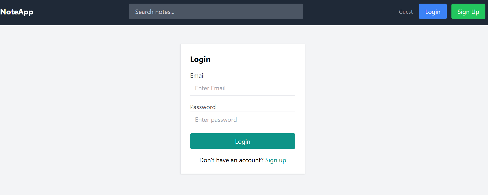
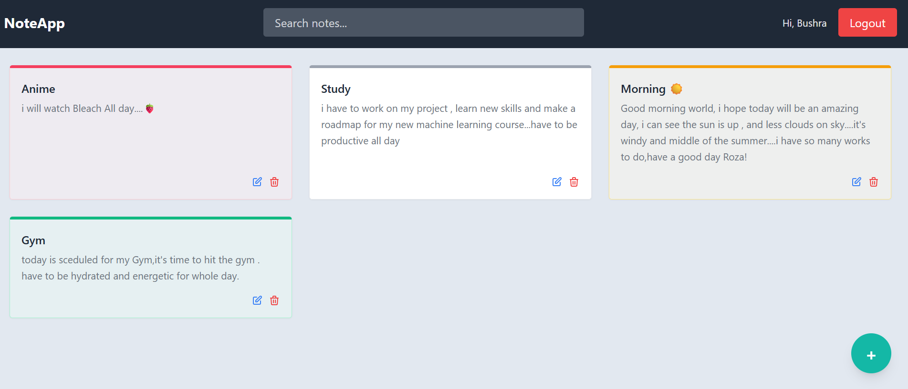
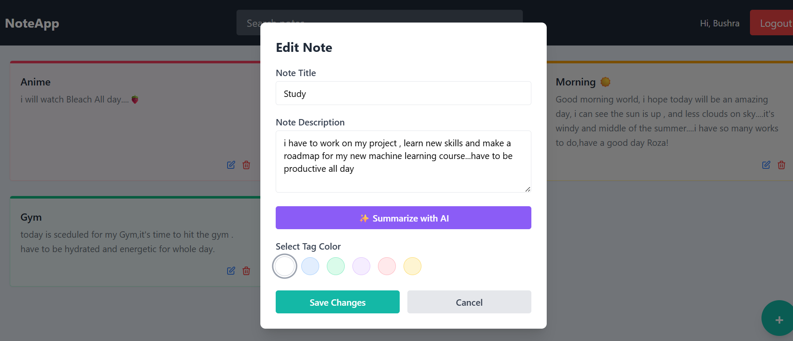

# 📝 NoteApp

A full-stack note-taking web application built with the MERN stack. Users can create, edit, delete, and search personal notes with color-coded organization and AI-powered summarization.

---

## 🚀 Live Demo
> Coming soon after deployment

---

## 📸 Screenshots

### Login Page

### Home Page

### Edit Note

---

## ✨ Features

- 🔐 User authentication (Register & Login with JWT)
- 📝 Create, edit, and delete notes
- 🎨 Color-coded note cards (6 color themes)
- 🔍 Real-time note search
- ✨ AI-powered note summarization (Gemini API)
- 📱 Responsive design
- 🔒 Protected routes — each user sees only their own notes

---

## 🛠️ Tech Stack

**Frontend:**
- React.js
- Tailwind CSS
- React Router

**Backend:**
- Node.js
- Express.js
- MongoDB + Mongoose
- JWT Authentication
- Google Gemini AI API

---

## 📁 Project Structure
AI-Notes-App/
├── frontend/
│   └── src/
│       ├── components/     # Reusable UI components
│       ├── pages/          # Login, Register, Home
│       ├── context/        # Auth & Toast context
│       └── utils/          # API fetch helper
│
└── server/
├── models/             # MongoDB schemas
├── routes/             # API endpoints
└── middleware/         # Auth & error handlers
